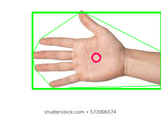
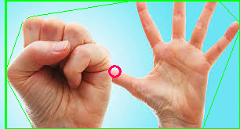
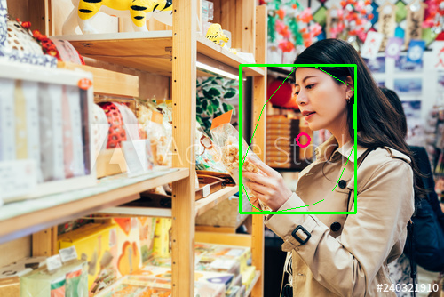
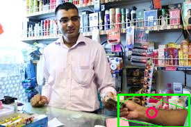

# OpenCV & TensorFlow Lite for Face and Hand Detection

A small collection of Python demos for **face detection** (OpenCV Haar cascades) and **hand detection** (both classical OpenCV skin-segmentation and a lightweight TensorFlow Lite hand-landmark model).

## Overview

This repository bundles three independent, runnable scripts groups built with OpenCV and NumPy:

- **Face detection** using OpenCV's built-in Haar cascade classifiers (frontal face + eyes), on a single image, on a live webcam feed, and a webcam-based face-cropping tool for collecting a face dataset.
- **Hand detection** using classical computer vision: HSV skin-color segmentation, morphological filtering, contour extraction, convex hull / convexity defects, and a heuristic finger-counter.
- **TensorFlow Lite** hand-landmark inference: loading Google MediaPipe `.tflite` models to predict 21 hand keypoints from an image and visualize them as a Delaunay triangulation.

Each script is self-contained. Several scripts have **hardcoded input paths** (originally pointing at the author's machine) that you must edit before running — these are called out below.

## Repository structure

```
face_det_opencv/
  face_det_opencv.py    # Haar-cascade face + eye detection on a single image
  video_face.py         # Haar-cascade face + eye detection on a live webcam
  crop_video_face.py    # Webcam tool: crop & save detected faces (dataset collection)
hand_detection_opencv/
  hand_det.py           # HSV skin-segmentation hand detection + finger counting
  results/              # Saved output images (see Results below)
tflite/
  tflite.py             # Run hand_landmark.tflite on an image; plot 21 keypoints
  mesh.py               # Standalone Delaunay-triangulation plotting demo
  models/               # hand_landmark.tflite, hand_landmark_3d.tflite, palm_detection.tflite
images/                 # Sample input images (hands, shopkeeper, sanitizer, ...)
```

## Requirements

There is no `requirements.txt` or `environment.yml`; dependencies are inferred from the imports:

- Python 3
- [OpenCV](https://pypi.org/project/opencv-python/) (`cv2`) — includes the bundled Haar cascades used via `cv2.data.haarcascades`
- NumPy
- TensorFlow (provides `tf.lite.Interpreter` used in `tflite/tflite.py`)
- Matplotlib (for the TFLite visualization and `mesh.py`)
- Tkinter (`import tkinter`; the Matplotlib backend — on Linux install via your system package manager, e.g. `python3-tk`)

Install the Python packages with:

```bash
pip install opencv-python numpy tensorflow matplotlib
```

## Usage

### Face detection (OpenCV Haar cascades)

**Single image** — edit the `img` path near the top of the script to point at a local image, then run:

```bash
cd face_det_opencv
python face_det_opencv.py
```

Detected faces are drawn with a rectangle and eyes with a green rectangle; the result is shown in a window (press any key to close).

**Live webcam** — uses camera index `0`:

```bash
cd face_det_opencv
python video_face.py
```

Faces and eyes are boxed in real time. Press **SPACE** to save the current frame to an `IMGS/` folder (create it first) and **ESC** to quit.

**Face-cropping / dataset collection** — uses camera index `1`:

```bash
cd face_det_opencv
python crop_video_face.py
```

It prompts for a person's name, creates `../data/<name>/`, and continuously crops each detected face (with a 50-px margin, resized to 500×500) into that folder. Press **SPACE** to also save the full frame and **ESC** to quit. Adjust the camera index if you only have one webcam.

### Hand detection (classical OpenCV)

Edit the `img` path near the top of `hand_det.py` to point at a local image (e.g. one of the samples in `images/`), then run:

```bash
cd hand_detection_opencv
python hand_det.py
```

The pipeline converts the image to HSV, thresholds skin color, applies morphological filtering, finds the largest contour, computes the convex hull / convexity defects and the contour's center of mass, and counts raised fingers by comparing fingertip-to-center distances against the average finger-webbing distance. It draws the bounding box, center of mass, and defect lines, and shows the result (press any key to close). An HSV trackbar window is also created for tuning, and a commented-out webcam loop at the bottom of the file provides a live-video variant.

### TensorFlow Lite hand landmarks

`tflite/tflite.py` loads `hand_landmark.tflite`, resizes the input image to 256×256, runs inference to obtain 21 `(x, y)` landmarks, and plots them as a Delaunay triangulation.

> **Note on paths:** the script's `img` and model `path` variables do not match this repository's layout. When running from the `tflite/` directory, set `img = "../images/sanitizer.jpeg"` and `path = "models/hand_landmark.tflite"` (or use absolute paths).

```bash
cd tflite
python tflite.py
```

`mesh.py` is a standalone Matplotlib demo that plots a Delaunay triangulation of synthetic points (no model required):

```bash
cd tflite
python mesh.py
```

## Models

The `tflite/models/` directory contains Google MediaPipe hand-tracking models: `hand_landmark.tflite`, `hand_landmark_3d.tflite`, and `palm_detection.tflite`. Only `hand_landmark.tflite` is referenced by `tflite.py`; the palm-detection and 3D-landmark models are included but not yet wired into any script. Credit for these `.tflite` models goes to the [MediaPipe](https://github.com/google/mediapipe) project.

## Results

Example outputs from the classical hand-detection pipeline (`hand_detection_opencv/hand_det.py`), stored under `hand_detection_opencv/results/`:

| Single hand | Two hands |
| --- | --- |
|  |  |

| Hand and face | Sanitizer scene |
| --- | --- |
|  |  |



Additional result frames are available in the same folder (`shopkeeper_hand2.png`, `shopkeeper_hand3.png`).

## Datasets

No external dataset is required. The Haar cascade classifiers ship with OpenCV (accessed via `cv2.data.haarcascades`), and sample input images are provided in the `images/` directory. The `crop_video_face.py` script is itself a tool for building a face dataset from webcam captures.

## License

This project is licensed under the MIT License — see the [LICENSE](LICENSE) file for details.